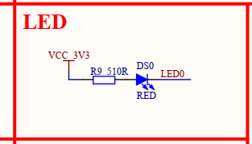
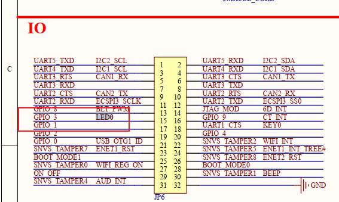
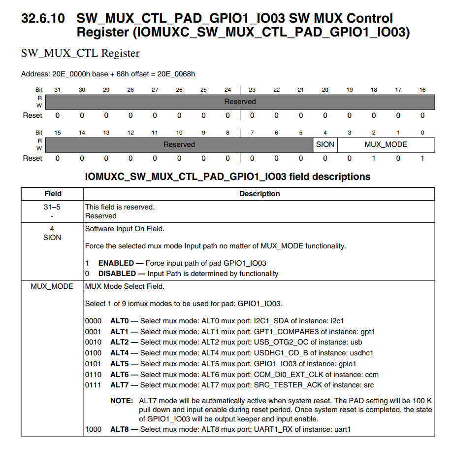
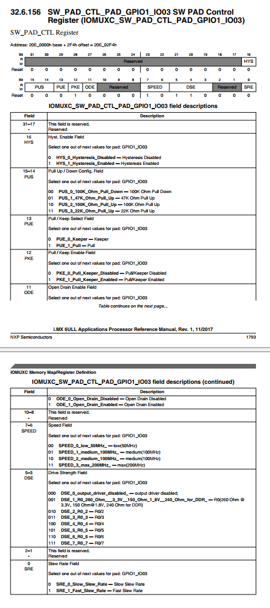
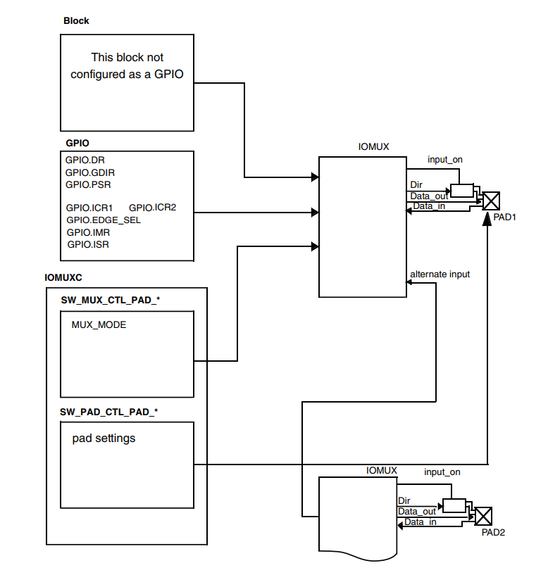
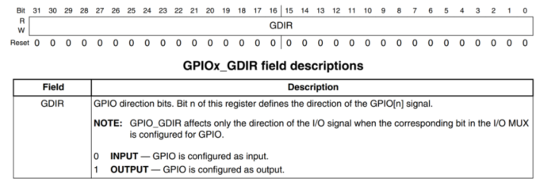
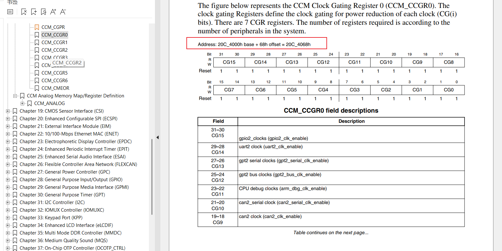

# Why using Assembly code?
1. init some soc device
2. init DDR(IMX6U dont need)
3. set sp pointer (normal point to DDR)

# How to use Led?
## check Led's Schematic Diagram(原理图)

 
It is Led0 

## Find IO port

it is GPIO3

## Find GPIO1_IO03

there are 2 GPIO1_1O03

Mux and PAD ,you can distinct them with function

Mux is for enable 

Pad is for config 

## How to config them？

This is a general schematic diagram of GPIO

you can see SW_MUX_CTR_PAD_ is Mode set, SW_MUX_PAD_CTL_PAD is setting

There are 8 registers DR. GDIR PSR .. as GPIO 

set 1 to output if GPIO3 then set bit 3 = 1

We need use this register to control function

## Enable Clock

We can enable all GPIO clock first

There are 7 of them

# process

1. enable all clock
2. set Mux to GPIO mode for led
3. set config of GPIO by setting PAD_CTL
4. set default config