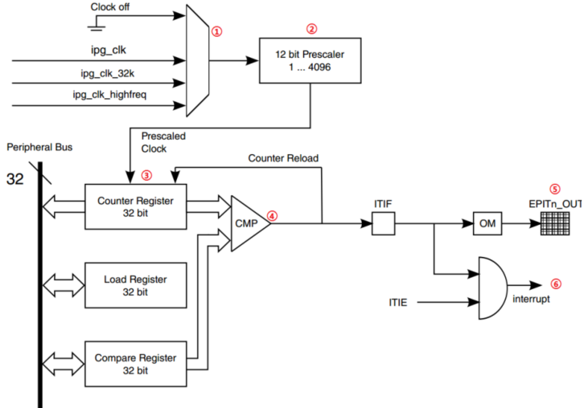
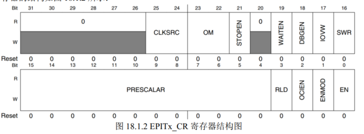
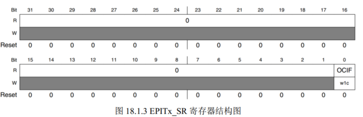

# EPIT

Enhanced Periodic Interrupt Timer



## 原理图

① 时钟源选择 

IPG_CLK , IPG_CLK_32K, IPG_CLK_HIGHFREQ

② 预分频器 prescaler

12 bit 0 ~ 4095

③ 进入内部寄存器

conuter  Load compare 三个寄存器(32bit)  

计数器是向下的 只要给一个初始值  一直递减为0

④ 比较器

⑤ 设置引脚输出

⑥ 产生定时中断

## 工作模式

### set-and-forget

设置方法： EPITx_CR 寄存器的RLD 位置为1

此模式下计数器从加载寄存器 EPIT_LR (load)中获取 不能直接向计数器中写入 只要计数为0 就重新获取EPIT_LR 的

### free-running

设置方法： EPITx_CR 寄存器的RLD 位置为0

当计数器到0时 会从 0xFFFFFFFF开始计时

## EPITx_CR



**CLKSRC**

0 关闭 , 1 IPG_CLK,  2 IPG_CLK_HIGHFREQ, 3 IPG_CLK_32K  本次设置为1

**PRESCALAR**

分频数 0~4095 设置 1 ~ 4096 分频

**RLD**

工作模式  我们设置为 1 set-and-forget

**OCIEN**

比较中断使能位 0 为 关闭比较中断 1 打开比较中断

**写1清除（W1C，Write 1 to Clear）** 

- EPIT1->SR |= 1 << 0

- 对于某些硬件寄存器的标志位，写入1会自动清除（置0）该位，而写0则无效。
- 这样设计是为了防止误操作，确保只有明确写1时才清除标志，常用于中断、定时器等事件标志位的复位。

**ENMOD**

计数器初始值 0 为上次关闭时的值 1 为load的值

**EN**

使能位 1 使能

## EPITx_SR



只有 OCIF 有效 1 时有事件发生 0 表示无事件


## 设置步骤

1.设置时钟源

2.设置分频值

3.设置工作模式

4.设置初始来源

5.设置比较中断

6.设置加载值和比较值

7.EPIT1 中断设置和中断服务函数编写

使能 GIC 中对应的 EPIT1 中断，注册中断服务函数，如果需要的话还可以设置中断优先级  

8.使能 EPIT1 定时器

## 计算分频方法

Tout = ((frac 分频值 + 1) * val 设置倒计数值 ) / Tclk(66Mhz)

1/Mhz 单位为微秒

1Mhz = 1000000Hz 1s 1000000次

设置500ms 

500000 * 66 = (frac + 1) * val

设置 1分频

val = 33000000


设置10 ms 按键延时 

10 000 * 66 = （0 + 1） * val

val = 660000

```c
void epit1_Init(unsigned int frac, unsigned int val)
{
    if(frac > 0xFFF)
    {
        frac = 0xFFF; // 最大值 12位
    }
    EPIT1->CR = 0; // clear

    // 设置 CR
    // 25:24    01 选择 IPG_CLK 66 Mhz
    // 15:4     frac倍分频
    // 3      从LR重新加载 1
    // 2      使能 1 
    // 0      先关闭 后续打开
    EPIT1->CR = (1 << 24) | (frac << 4) | (1 << 3) | (1 << 2);
    EPIT1->LR = val; // 设置倒计数值
    EPIT1->CMPR = 0; // 比较寄存器值

    GIC_EnableIRQ(EPIT1_IRQn); // 使能中断

    system_register_irqhandler(EPIT1_IRQn, epit1_Irqhandler, NULL); // 注册中断处理函数

    EPIT1->CR |= 1 << 0; .. 打开 EPIT1
}
```

