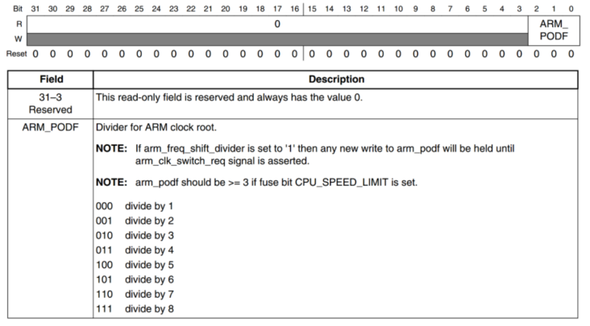

# 时钟来源


2 part ：

32.768 KHz(RTC) : 

- 主要用于实时时钟（RTC）模块，提供低功耗、持续运行的时钟源。
- 即使主系统断电或休眠，RTC晶振仍可维持时间计数。
- 用于系统时间、定时唤醒等功能。

24 MHz(kernel):

- 作为主频时钟源，供CPU、内存、外设等模块工作。
- 通常在系统上电后由PLL倍频生成更高频率，驱动整个SoC的运行。
- 断电或休眠时，主晶振可能停止工作。

# 7 路 PLL时钟源


## Arm_PLL(PLL1)

Arm内核 

## 528_PLL (PLL2)

System_PLL 固定22倍频不可修改 24*22 = 528 MHz 内部总线的时钟源  分4路 PFD

如：DDR ， 内部处理逻辑单元， NAND/NOR 接口等

## USB1_PLL (PLL3)

分四路 PFD 固定20 倍频 24*20 = 480 

主要用于 USB1PHY 也可作为其他外设的根时钟

## USB2_PLL(PLL7)

固定20 倍频 24*20 = 480 

给USB2PHY 使用

## ENET_PLL(PLL6)

固定 20+5/6 倍频 固定20 倍频 24*（20+5/6） = 500 

用于生成网络所需要时钟 可在其基础上生成 25/50/100/125 MHz的网络时钟

## VIDEO_PLL(PLL5)

用于显示相关的外设 如LCD

输出范围 650~1300

可选择 1/2/4/8/16 分频

## AUDIO_PLL(PPL4)

用于音频外设

输出范围 650~1300

可选1/2/4分配


# 时钟树


## General

如上图分三部分

### CLOCK_SWITCHER 

7路 PLL 和 8路 PFD

### CLOCK_ROOT GENERATOR 

具体设置和操作

### SYSTEM CLOCKS

芯片外设

## Detail


如ESAI 有四路源 1. PLL4  2. PLL3_PFD2  3. PLL5  4. PLL3_SW_CLK

用 CSCMR2[ESAI_CLK_SEL] 寄存器[位] 确定时钟源

/2 和 /8 两个寄存器[位] 分别是可以设置的 分频器 

# kernel CLK


内核时钟来源与 PLL1 X Mhz

用CACRR[ARM_PODF] 进行分频 （第二个分频图中有误 并未分频） 得到 X/2

推荐设置主频为 528 则设置PLL1为 1056 && CACRR[ARM_PODF] 2分频 即可

### 设置 PLL1 1056 

CCM_ANALOG_PLL_ARMn 寄存器


DIV_SELECT:

Fout = Fin * DIV_SELECT / 2  由于 Fin为 24 则算出 DIV为 88 

#### 改为其他时钟源再切换回来

设置PLL1时钟频率时需要将内核时钟改为其他时钟源再切换回来


如图 ① 为最终输出 ，先将时钟源改为 step_clk （修改CCSR[PLL1_SW_CLK_SEL]）, 最终再改回来

改为step_clk 之前要先将CCSR[STEP_SEL] 改为 OSC_CLK 24 MHZ

### 设置2分频



CCM_CACRR[ARM_PODF] 为 001 即可

代码如下

```c
    unsigned int reg = 0;
    // 1 set ARM core clock to 528Mhz
    // 1.1 if main chage it to 24Mhz step clock
    if(((CCM->CCSR >> 2) & 0X1) == 0) // pull_main_clk 如果当前在mainclk 切换
    {
        CCM->CCSR &= ~(1 << 8); // step_clk 24Mhz
        CCM->CCSR |= (1 << 2);  // set step_clk
    }

    // 1.2 set main 1056    ---  528*2
	// 13 Enbale  88计算结果   &0x7f 是0x 0111 1111 只修改低7位
    CCM_ANALOG->PLL_ARM = (1 << 13) | ((88 << 0) & 0x7f); 
    CCM->CACRR = 1; /* 设置2分频 */
    CCM->CCSR &= ~(1 << 2); /* 设置pll1_sw_clk=pll1_main_clk=1056MHz */ //切换回去
```

# PFD CLK


此表为厂商推荐值

## CCM_ANALOG_PFD_528n(PLL2) 


四路 每一路由三部分组成

PFDX_CLKGATE  0 为 Enable

PFDX_STABLE   read only 判断是否stable

PFDX_FRAC  Out = 528 * 18 / PFDX_FRAC 

计算 的到 PFD0_FRAC =27 , PFD1_FRAC = 16, PFD2_FRAC = 23 , PFD3_FRAC = 32

## CCM_ANALOG_PFD_480n(PLL3) 


结构相同 公式为

Out = 480 * 18 / PFDX_FRAC 

代码如下

```c
    // 2 set PLL2(SYS PLL)
    reg = CCM_ANALOG->PFD_528;
    reg &= ~(0x3F3F3F3F);       // clear all bits
    reg |= 32 << 24;            // PLL_FD3 528*18/32 = 297Mhz
    reg |= 23 << 16;            // PLL_FD2 528*18/24 = 396Mhz
    reg |= 16 << 8;             // PLL_FD1 528*18/16 = 594Mhz
    reg |= 27 << 0;             // PLL_FD0 528*18/27 = 352Mhz
    CCM_ANALOG->PFD_528 = reg;  // write back to PLL_SYS

    // 3 set PLL3(USB1) 
    reg = 0;                            //clear reg
    reg = CCM_ANALOG->PFD_480;
    reg &= ~(0X3F3F3F3F);       // clear all bits
    reg |= 19 << 24;            // PFD3 480*18/19 = 454.7Mhz
    reg |= 17 << 16;            // PFD2 480*18/17 = 508.25Mhz
    reg |= 16 << 8;             // PFD1 480*18/16 = 540Mhz
    reg |= 12 << 0;             // PFD0 480*18/12 = 720Mhz
    CCM_ANALOG->PFD_480 = reg;  // write back to PFD

```

# 其他CLK

设置 AHB & IPG & PERCLK


为什么要单独设这三个？ 

因为PERCLK 和 IPG 分别是 EPIT I2C ADC WDOG 的时钟 而他们两个又用到了 AHB为源 所以举例设置这三个时钟源

实际上每一个用到的外设时钟都要设置


根据上图时钟推荐范围

设置 AHB_CLK_ROOT 132    IPG_CLK_ROOT 66   PERCLK_CLK_ROOT 66

## AHB & IPG


①处 用CBCMR[PRE_PERIPH_CLK_SEL] 选择时钟源 01 默认为PLL2_PFD2  = 396

②处 选择0 CBCDR[PERIPH_CLK_SEL] 为0

③处 设置 CBCDR[AHB_PODF] = 2  3分频  396 / 3 = 132  -- AHB

④处 设置 CBCDR[IPG_PODF] = 1  2分频  132 /2 = 66

## PERCLK


CSCMR1[PERCLK_CLK_SEL] 图中未标出 选择 OSC(固定24) 还是 下面

我们选择下面 IPG的66MHz 

另外 用 CSCMR1[PERCLK_PODF] 选择1分频

CCM_CBCDR


代码实现

```c
    // 4 set AHB max 132 Mhz
    CCM->CBCMR &= ~(3 << 18); // clear PRE_PERIPH_CLK_SEL
    CCM->CBCMR |= (1 << 18); // pre_periph_clk = PLL2_PDF2 = 396Mhz
    CCM->CBCDR &= ~(1 << 25); //periph_clk = pre_periph_clk = 396
    while((CCM->CDHIPR & (1 << 5))); // wait for AHB clock ready

#if 0  // 系统默认已经设置好三分配 但是由于 bug 以下代码会卡死 先不设置
    CCM->CBCDR &= ~(7 << 10);	// clear 0111
    CCM->CBCDR |= (2 << 10);    /* 3分频率 */
    while(CCM->CDHIPR & (1 << 1)); /* 等待握手信号 */
#endif

    // 5 set IPG_CLK_ROOT  max 66Mhz
    CCM->CBCDR &= ~(3 << 8); // clear IPG_PODF
    CCM->CBCDR |= (1 << 8);  // set devide 2 IPG_CLK_Root = 66

    // 6 set PERCLK_CLK_ROOT 
    CCM->CSCMR1 &= ~(1 << 6);       // set PERCLK_CLK_ROOT as IPG 
    CCM->CSCMR1 &= ~(0x3f << 0);    // set PERCLK_PODF = 0 devide 1

```

