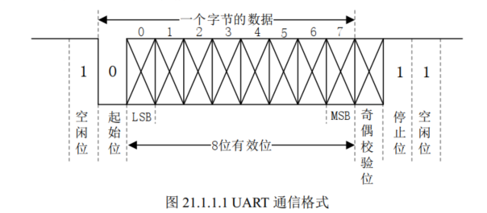
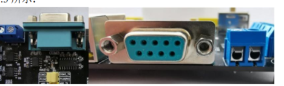
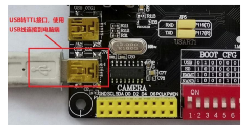
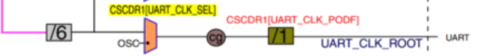
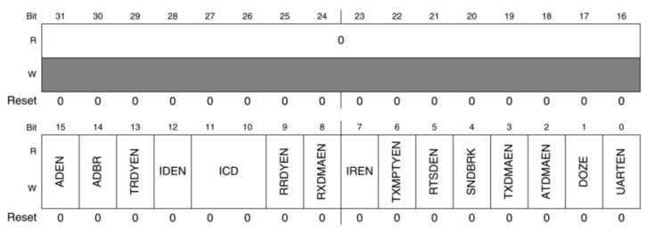
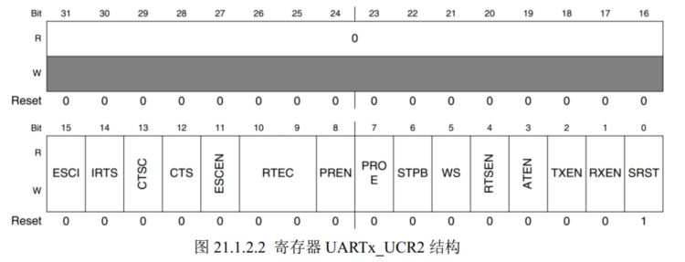
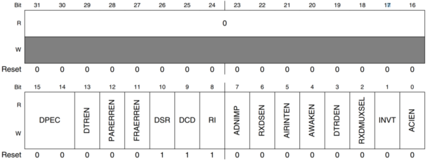
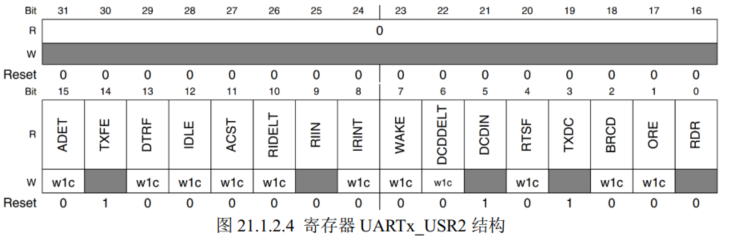
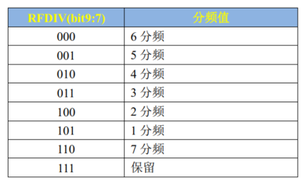
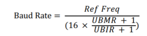

# UART

## UART原理

串口全称串行接口也叫COM接口，数据通过顺序传输

UART发送接收各用一条线，最少使用三条，TXD(发), RXD(接), GND(地)

**UART** 

Universal Asynchronous Receiver/Trasmitter 异步串行收发器 

**USART**

Universal Synchronous/Asynchronous Receiver/Trasmitter  同步/异步串行收发器

多一条时钟线 可以用作UART

### 通信格式



1bit

**空闲位**：数据线在空闲状态的时候为逻辑“1”状态，也就是高电平，表示没有数据线空闲，没有数据传输。

**起始位**：当要传输数据的时候先传输一个逻辑“0”，也就是将数据线拉低，表示开始数据传输。

**数据位**： 数据位就是实际要传输的数据，数据位数可选择 5~8 位，我们一般都是按照字节传输数据的，一个字节 8 位，因此数据位通常是 8 位的。低位在前，先传输，高位最后传输。

**奇偶校验位**： 这是对数据中“1”的位数进行奇偶校验用的，可以不使用奇偶校验功能。

**停止位**：数据传输完成标志位，停止位的位数可以选择 1 位、 1.5 位或 2 位高电平，一般都选择 1 位停止位。

**波特率**：波特率就是 UART 数据传输的速率，也就是每秒传输的数据位数，一般选择 9600、19200、 115200 等。

### UART电平标准

一般接口有

RS232



由于目前电脑都没有DB9接口 就有很多USB转串口TTL的芯片

如 CH340 PL2303 实现TTL转USB

TTL




## UART配置

IMX6U的UART 共有8个：特性如下

① 兼容 TIA/EIA-232F 标准，速度最高可到 5Mbit/S。

② 支持串行 IR 接口，兼容 IrDA，最高可到 115.2Kbit/s。

③ 支持 9 位或者多节点模式(RS-485)。

④ 1 或 2 位停止位。

⑤ 可编程的奇偶校验(奇校验和偶校验)。

⑥ 自动波特率检测(最高支持 115.2Kbit/S)

### 时钟源



CSCDR1[UART_CLK_SEL] 选择 0 为 PLL3_80M   1为OSC_CLK 24M 选择0

CSCDR1[UART_CLK_PODF] bit 5:0 设置64分频 设置1分频 最终时钟为 80Mhz

### UARTx_UCR1



ADBR： 0 关闭波特率自动检测 1 使能自动检测

UARTEN: 0 关闭UART 1使能

### UARTx_UCR2



IRTS: 0 使用RTS引脚功能 1 关闭

PREN: 奇偶校验使能 0 关闭 1打开

PROE: 奇偶校验模式选择 0 选择偶 1选择奇

STOP: 停止位数量 0 ： 1位 		1：2位

WS: 数据位长度 	0 ： 7位  	   1：8位

TXEN: 发送使能位 0 关闭发送功能  1打开

RXEN: 接收使能 0 关闭接收功能 1打开

SRST: 复位 0复位UART  1表示复为完成 --只能写0 读1

### UARTx_UCR3



RXDMUXSEL 始终为1

### UARTx_USR2



TXDC：发送完成标志位 1表示缓冲(TxFIFO)和移位寄存器位空 发送完成 向 TxFIFO写入数据此位就会清零

RDR:     数据接收标志     1表示至少收到一个数据  从 UARTx_URXD读取数据后自动清零

### 其他寄存器

UARTx_UFCR[RFDIV] 9:7   设置时钟分频



波特率计算公式



Ref Freq:进入UART的最终频率

UBMR： UARTx_UMBR的值

UBIR：UARTx_UMIR的值

设置1分频 则ref freq = 80 设置 UBIR = 71 UBMR = 3124 则 Baud Rate = 115200 

最后UARTx_URXD接收寄存器 UARTx_UTXD发送寄存器

## 配置步骤

1.设置UART1时钟源为  PLL3_80M

函数`imx6u_clkinit`

```c++
    /* 设置UART根时钟为pll3_80M=80M */
    CCM->CSCDR1 &= ~ (1 << 6);  /* UART_CLK_ROOT=80M */
    CCM->CSCDR1 &= ~0X3F;       /* 1分频 */
```


2.初始化IO 设置UART1寄存器的 UART1_UCR1 UART1_UCR2 UART1_UCR3 设置上述内容

3.使能UART1

4.收发数据

```c++
void uart_Init()
{
    // init io
    uart_io_Init();
    // init uart
    uart_disable(UART1);
    uart_softreset(UART1);

    //clear
    UART1->UCR1 = 0; // clear UCR1
    UART1->UCR1 &= ~(1 << 14); // disable check baud rate

    // set UCR2
    // bit 14   1  忽略 RTS
    // bit 8    0  关闭奇偶校验
    // bit 6    0  1位停止位
    // bit 5    1  8位数据位
    // bit 2    1  使能发送
    // bit 1    1  使能接收
    UART1->UCR2 |= (1 << 14) | (1 << 5) | (1 << 2) | (1 << 1);

    UART1->UCR3 |= 1 << 2; //bit2 must 1

    // set baud rate
    // UFCR 9:7 101 1分频
    // UBMR 3124  
    // UBIR 71
    // baud rate 115200
    UART1->UFCR = 5 << 7;
    UART1->UBIR = 71;
    UART1->UBMR = 3124;
    //可以通过这个函数直接设置
    //uart_setbaudrate(UART1, 115200, 80000000);
    uart_enable(UART1);
}
```


# 集成printf

1. 复制文件 make加下
2. Makefile添加 

```shell
LIBPATH         :=  -lgcc -L /usr/local/arm/gcc-linaro-4.9.4-2017.01-x86_64_arm-linux-gnueabihf/lib/gcc/arm-linux-gnueabihf/4.9.4

//编译二进制时 LD使用
$(TARGET).bin : $(OBJS)
	$(LD) -Tlink.lds -o $(TARGET).elf $^ $(LIBPATH)
	$(OBJCOPY) -O binary -S $(TARGET).elf $@
	$(OBJDUMP) -D -m arm $(TARGET).elf > $(TARGET).dis
```

注意 `printf`  `scanf`使用的时我们实现的`putc `   `getc` 和 `puts`

