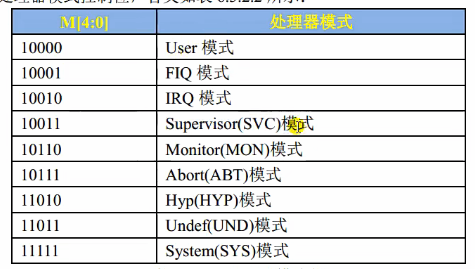

# Env set

## 1.set core mode

First we need set mode to SVC that you can get all resources

set CPRS register to 10011 to set SVC mode

## 2.set stack point

SP can point to RAM or DDR

512M is - 0X800000000 - 0X9FFFFFFF

set stack is 2 MB = 0X200000

BCS CoreA7 is Downward growth set SP as 0X80200000

## 3.Turn to C Code

using b point to main function
