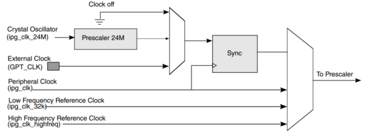
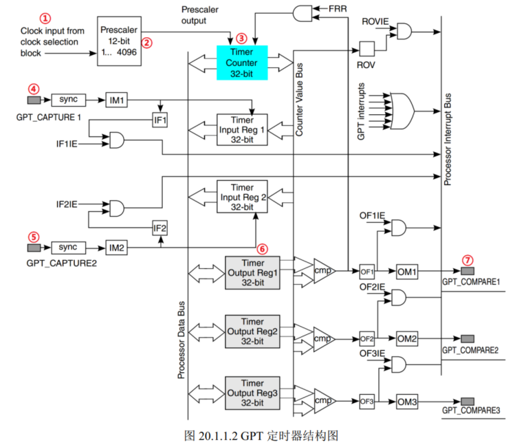
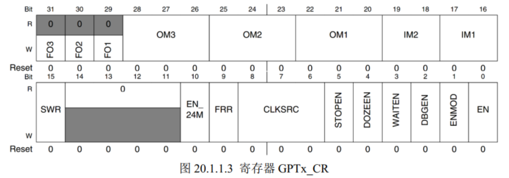
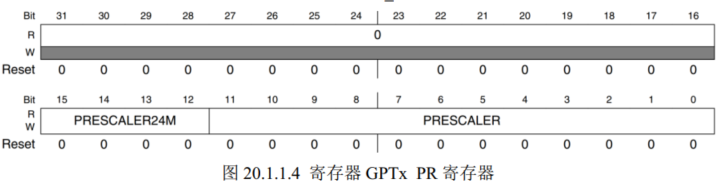
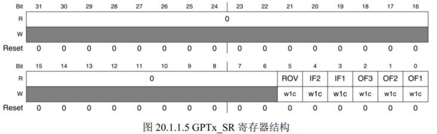

# GPT定时器

高精度定时器 General Purpose Timer

## 基本构造

① 可选5个时钟源 上图 我们选择IPG = 66Mhz

② 12位分频

③ 32位计数器

④ ⑤ 两路输入捕获通道

⑥ 输出比较寄存器

⑦ 三路比较中断

## 工作模式

### restart mode

GPTx_CR[FRR] 设置 0

当计数器与比较寄存器的值相等就会清0. 重新从 0x00000000开始向上计数 

只有比较通道1有此模式，向通道1的比较寄存器写入任何数据都会复位 

### free-run mode

GPTx_CR[FRR] 设置 1

对于三个比较通道都有效，比较事件发生后不会复位计数器 继续计数直到 0xFFFFFFFF 然后回滚到 0x00000000

## 寄存器

### GPTx_CR

SWR: 写1复位定时器 复位后自动清零

FRR:  工作模式选择 0restart 和1 freerun

CLKSRC: 时钟源选择 选择1 IPG_CLK

ENMODE:  GPT使能模式 为0时关闭 计数器会保持定时器关闭时的值

为1时不保存 计数器清零

EN: GPT使能位 1 使能 0 关闭

### GPTx_PR

PRESCALER: 12位分频

### GPTx_SR

ROV: 回滚标志位 计数从 0xFFFFFFFF 回滚到 0x0000000 时此位为1

IF2 IF1 两路输入捕获位 如果有输入捕获中断需要在中断处理函数中清除此位

OF3 OF2 OF1 输出比较中断标志位：当输出比较实际发生后此位置位1，共三路，使用比较中断后 需要在中断处理函数中处理此位

### GPTx_CNT

报存当前计数值

### GPTx_OCR 

32 位   存放比较值

## 延时原理

如果设置 GPT 定时器的时钟源为 ipg_clk=66MHz，设置 66 分频，那么进入 GPT定时器的最终时钟频率就是 66/66=1MHz，周期为 1us。 GPT 的计数器每计一个数就表示“过去”了 1us。

如果计 10 个数就表示“过去”了 10us。通过读取寄存器 GPTx_CNT 中的值就知道计了个数，比如现在要延时100us，那么进入延时函数以后纪录下寄存器 GPTx_CNT中的值为 200，当 GPTx_CNT 中的值为 300 的时候就表示 100us 过去了，也就是延时结束。 

GPTx_CNT 是个32 位寄存器，如果时钟为 1MHz 的话， GPTx_CNT 最多可以实现 0XFFFFFFFFus=4294967295us ≈4294s≈72min。也就是说 72 分钟以后 GPTx_CNT 寄存器就会回滚到 0X00000000，也就是溢出，所以需要在延时函数中要处理溢出的情况。  

1. 设置GPT1_CR[SWR] 复位定时器

   设置GPT1_CR[CLKSRC]选择 GPT1时钟源位IPG_CLK

   设置 工作模式为freerun

2. 设置GPT1_PR[PRESCALAR] 分频值 为65(66 倍)

3. 设置GPT1 比较值为最大 0XFFFFFFFF 不使用比较中断 

4. 设置GPT1_CR[EN]为 1 使能定时器

5. 编写延时函数
