# Interrupt

## interrupt vector table

Cortex-A7 Interrupt vector table

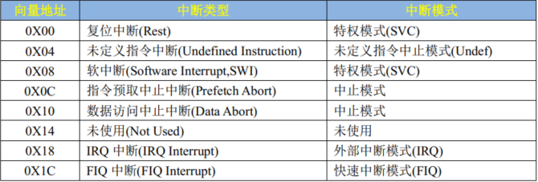

Because, 0X14 not use.

Actually, there are 7 Interrupt.

Only 7? of course not they are just **7 types**.

Usually we use Rest && IRQ Interrupt

### where set the vector table?

At the start.s file  begin we need set the table

```assembly
.global _start

_start:
 	/*Interrupt verctor table*/
    ldr pc, =Reset_Handler              /*reset*/
    ldr pc, =Undef_Handler              /*undefined*/
    ldr pc, =SVC_Handler                /*supervisor*/
    ldr pc, =PrefAbort_Handler          /*prefetch abort*/
    ldr pc, =DataAbort_Handler          /*data abort*/
    ldr pc, =NotUsed_Handler            /*not used*/
    ldr pc, =IRQ_Handler                /*IRQ*/
    ldr pc, =FIQ_Handler                /*FIQ*/

Reset_Handler:
	...
```

## GIC control

ARM Generic Interrupt Controller is  a Interrupt Controller for Cortex-A/R Cores

```
 Interrupt 0   ─────────┐                         |──────VFIQ───►   +-------------+
 Interrupt 1   ─────────┤                         |──────VIRQ───►   |             |
   ...                  ├──►  GIC Controller  ──►                   |  ARM Core   |
 Interrupt N-1 ─────────┤                         |───────FIQ───►   |             |
 Interrupt N   ─────────┘                         |───────IRQ───►   +-------------+
```

Interrupt  to 4 Signal:

VFIQ: Virtual FIQ       虚拟快速中断（用于虚拟化场景）

VIRQ: Virtual IRQ      虚拟普通中断（用于虚拟化场景）

FIQ:    Fast IRQ          快速中断请求（高优先级）

IRQ:    IRQ                  普通中断请求（低优先级）


This is GIC V2 （for Cortex A7）

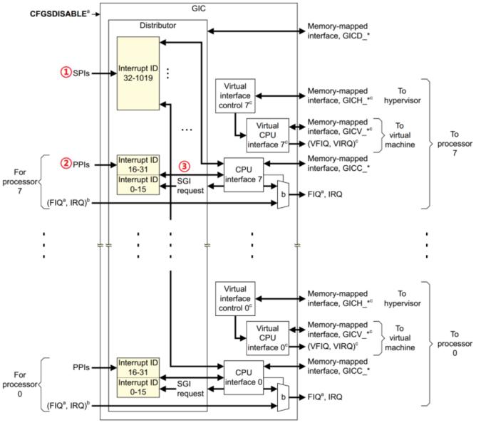

There are 3 kinds of interrupt:

SPI  Shared Peripheral外设 Interrupt ： Keyboard , UART , GPIO I2C/SPI 

PPI  Private  Peripheral Interrupt :  Every CPU's count Timer, watchdog Timer

SGI  Software-generated Interrupt: 多核通信

## Interrupt ID

ID 0 - 15     SGI

ID 16 - 31   PPI

ID 32 - 1019 SPI

IMX6U using 128 ID  so IMX6U have all 128 + 32(SGI + PPI) ID

Set In `MCIMX6Y2.h` ---   `typedef enum IRQn`

## GCI Logic mode

### Distributor

中断分发器： Receives all external interrupt requests and decides which CPU to forward them to

### CPU Interface

CPU接口(每核一份)：Receives interrupts from the Distributor and notifies the local CPU core

`core_ca7.h` Define `struct GIC_Type` 

### CP15 Coprocessor

It is used to access and control MMU(Memory Management Unit) , Cache, TLB(Translation Lookaside Buffer), interrupt control, performance monitoring features.

> **MMU（内存管理单元）是用于将虚拟地址转换为物理地址的硬件模块，支持内存保护、分页机制、缓存策略等。**
>  MMU (Memory Management Unit) is a hardware module responsible for translating virtual addresses into physical addresses. It also supports memory protection, paging mechanisms, and cache strategies.

> **TLB（快表）是用来缓存最近使用的地址映射结果的硬件缓存，可以加快地址转换速度。**
>  TLB (Translation Lookaside Buffer) is a hardware cache that stores recently used address translations to accelerate the address mapping process.

instructions: MRC,MCR,cond,opc, Rt, CRn, CRm, opc2

#### c0 register

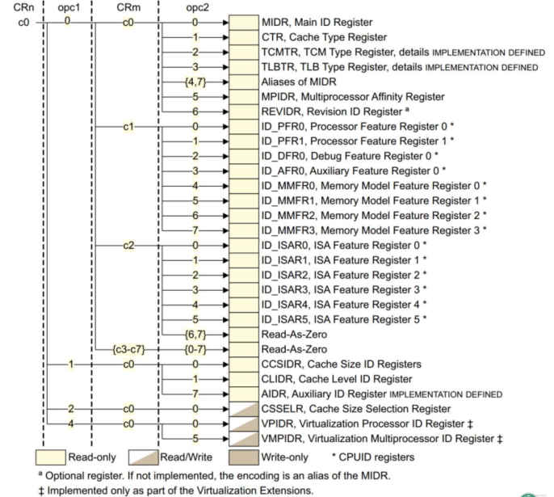

when CRn=c0 opc1=0 CRm=c0 opc2=0 is MIDR (Line1)

MIDR

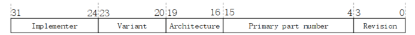

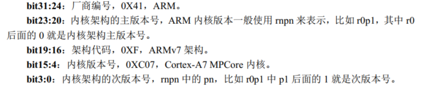

#### c1 register

SCTLR

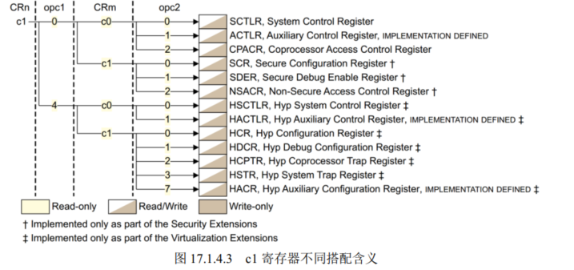

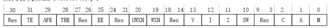


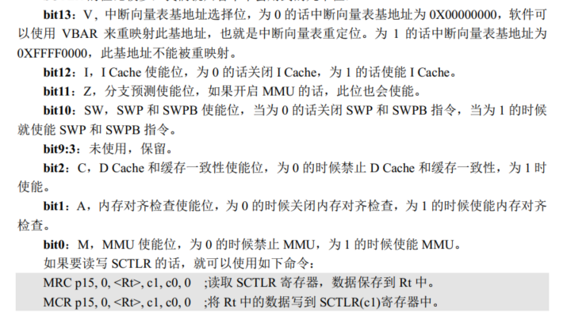

#### c12 register

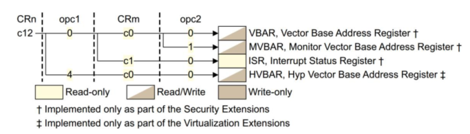

CRn=c12， opc1=0， CRm=c0， opc2=0    VBAR

#### c15 register

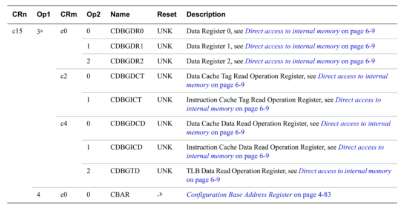

MRC p15, 4, r1, c15, c0, 0     CBAR

## Enable Interrupt

1.Open IRQ

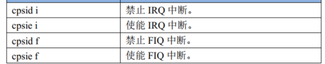

2.ID 0 - 1019 Enable and forbid


## Set interrupt priority level

### set Levels number

Cortex-A7 has 32 levels so set to 32 

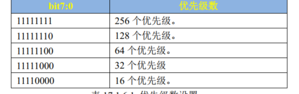

set GICC_PMR register as 11111000 -> 32

### set Priority preemption and sub-priority preemption Level

GICC_BPR

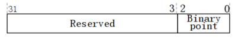

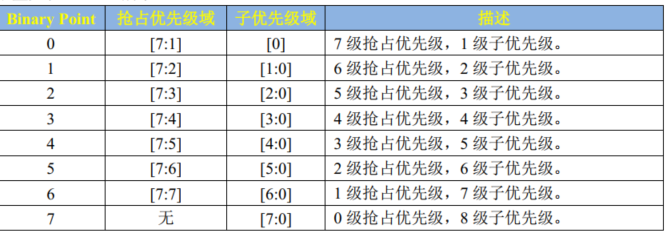

IMX6u is using 5bit(32priority) 

you can set all  preemption by setting binary point is 2

### set Priority

Using GICD_IPRIORITYR bit 7 : 4 set Priority  , 0 is max priority

if set ID 40 is  5 priority 

then `GICD_IPRIORITYR[40] = 5 << 3 `


