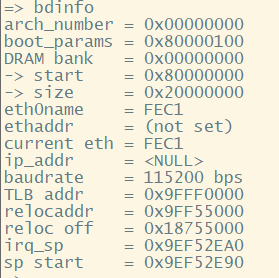
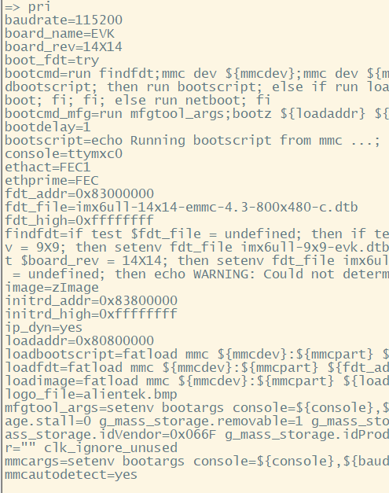
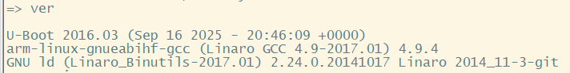
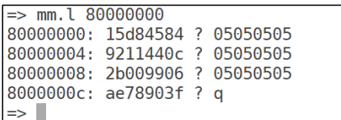
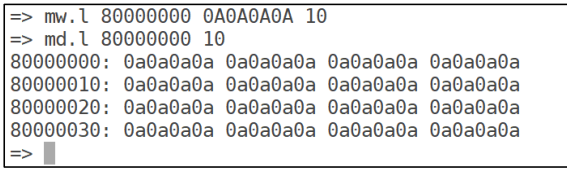
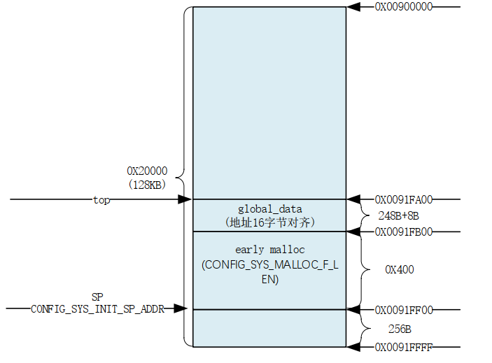
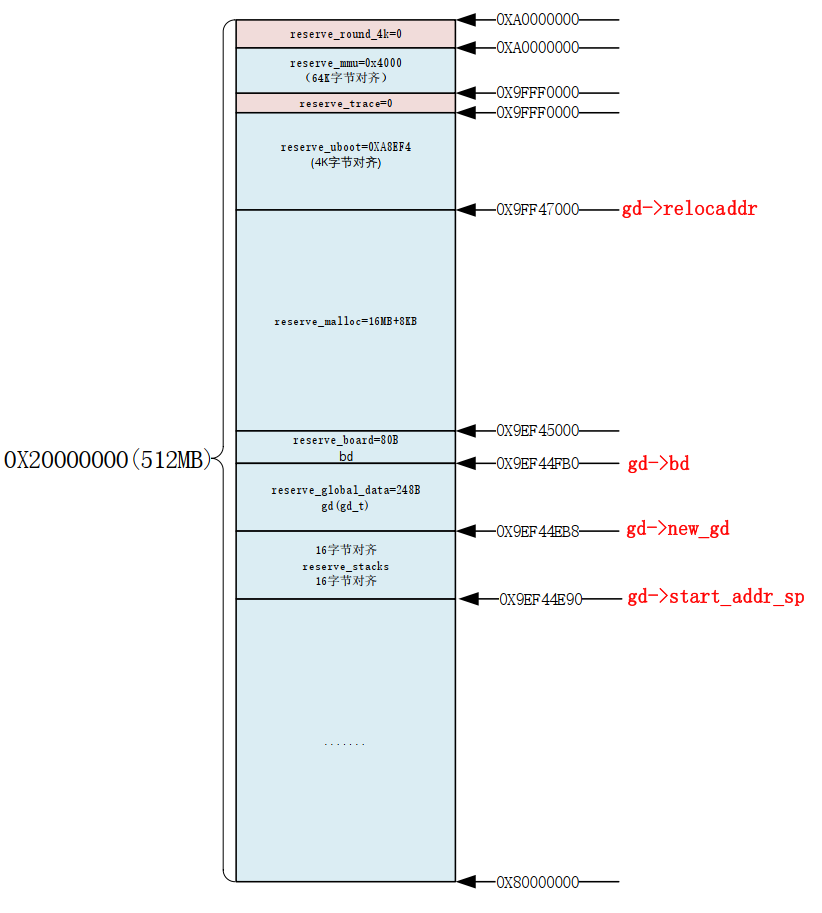
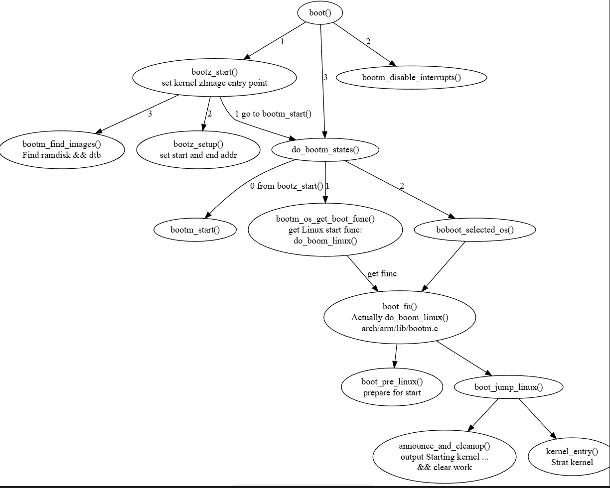
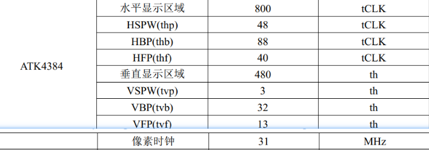
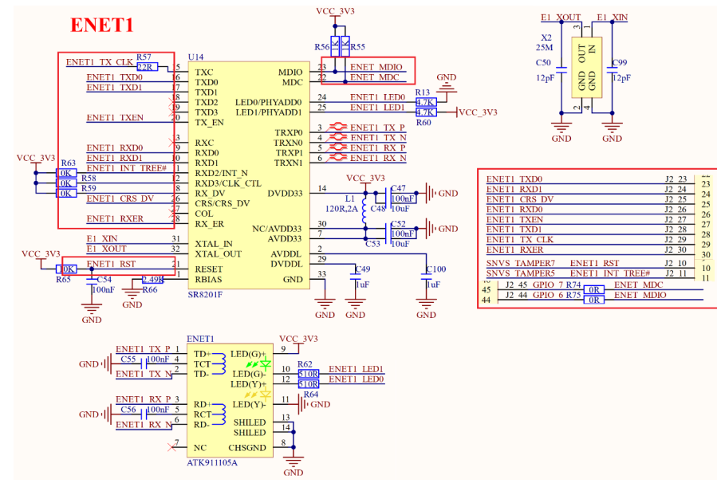

# U-boot compile

lib ncurses

```shell
sudo apt-get  install libncurses5-dev
```

CMD  re.sh

```bash
#!/bin/bash
# clean
make ARCH=arm CROSS_COMPILE=arm-linux-gnueabihf- distclean
# choose config
make ARCH=arm CROSS_COMPILE=arm-linux-gnueabihf- mx6ull_14x14_ddr512_emmc_defconfig
# compile
make V=1 ARCH=arm CROSS_COMPILE=arm-linux-gnueabihf- -j
```

then we get `u-boot.bin`

imxdownload to SD card

# U-boot CMD

## basic

`bdinfo`



`printfenv(pri)`



`version(ver)`



`help(?)`

to see other cmd and usage.

`setenv appauto 1`

`saveenv`

`bootz bootm boot` -- boot Linux

```shell
bootz [addr [initrd[:size]] [fdt]]
bootm addr
bootm [addr [initrd[:size]] [fdt]]	#with fdt
boot # will run param-bootcmd
```


## Memory-related

`md` show memory

```shell
#byte word long
md[.b, .w, .l] address [# of objects] 
#md.b 80000000 10
```

`nm` write memory

```shell
nm [.b, .w, .l] address
#nm.l 80000000
```

`mm` write memory

same as `nm` but it will self-increase.



`mw` use value to write memory

```
mw [.b, .w, .l] address value [count]
```



`cp` copy

```shell
cp [.b, .w, .l] source target count
#cp.l 80000000 80000100 10
```

`cmp` compare

```shell
cmp [.b, .w, .l] addr1 addr2 count
#cmp.l 80000000 80000100 10
```

## Network-related

`nfs`

```shell
nfs [loadAddress] [[hostIPaddr:]bootfilename]
#nfs 80800000 192.168.1.253:/home/aa
```

`tftp`

```shell
tftp [loadAddress] [[hostIPaddr:]bootfilename]
#tftp 80800000 zImage
#don't need all address just filename
```

## Filesystem-related 

# U-boot start process

`arch/arm/lib/crt0.S`

_main

## set sp

set sp-address && 8-byte alignment

## `board_init_f_alloc_reserve` 

to allocate memory for malloc and global data. && get top address.



## `board_init_f_init_reserve`   

clear GD set malloc address.

## `board_init_f `*

 In `common/board_f.c` 

`initcall_run_list` --  init_sequence_f(list) 

after init



## `relocate_code`*

`arch/arm/lib/relocae.S` 

copy u-boot from current place(usually NOR/NAND/SDRAM) to target address(usually DRAM)

`relocate_code` enables U-Boot to move from read-only or slow storage to high-speed memory after startup, improving performance and flexibility.

## `relocate_vectors ` *

`arch/arm/lib/relocae.S` 

After U-Boot is relocated to DRAM, when exceptions such as interrupts or faults occur, the CPU can jump to the correct exception handler code at the new address instead of the original location.

## `c_runtime_cpu_setup `

 set CPU cache MMU(Memory Management Unit) etc.

## `board_init_r` *

 In `common/board_r.c`

`initcall_run_list` -- init_sequence_r(list)

some other init after relocate and go to main loop.

- `run_main_loop ` 
  - `cli_loop` 
    - `cmd_process` -- deal with boot command

# Booting Linux process

images - an important global var.

```c++
typedef struct image_info {
	ulong		start, end;		/* start/end of blob */
	ulong		image_start, image_len; /* start of image within blob, len of image */
	ulong		load;			/* load addr for the image */
	uint8_t		comp, type, os;		/* compression, type of image, os type */
	uint8_t		arch;			/* CPU architecture */
} image_info_t;
```

**process**

```java
@startuml
digraph G{
    boot [label="boot()"]
    bootz_start [label="bootz_start()\nset kernel zImage entry point"]
    do_bootm_states [label="do_bootm_states()"]
    bootm_find_images [label="bootm_find_images()\nFind ramdisk && dtb"]
    bootz_setup [label="bootz_setup()\nset start and end addr"]
    bootm_start [label="bootm_start()"]
    
    bootm_disable_interrupts [label="bootm_disable_interrupts()"]

    bootm_os_get_boot_func [label="bootm_os_get_boot_func()\nget Linux start func: \n do_boom_linux()"]
    boot_selected_os [label="boboot_selected_os()"]
    boot_fn [label="boot_fn()\nActually do_boom_linux()\narch/arm/lib/bootm.c"]
    boot_pre_linux[label="boot_pre_linux()\nprepare for start"]
    boot_jump_linux [label="boot_jump_linux()"]
    announce_and_cleanup [label="announce_and_cleanup()\noutput Starting kernel ... \n&& clear work"]
    kernel_entry [label="kernel_entry()\nStrat kernel"]

    boot -> bootz_start [label="1"]
    bootz_start -> do_bootm_states [label="1 go to bootm_start()"]
    bootz_start -> bootz_setup [label="2"]
    bootz_start -> bootm_find_images [label="3"]

    boot -> bootm_disable_interrupts [label="2"]

    boot -> do_bootm_states [label="3"]
    do_bootm_states -> bootm_start [label="0 from bootz_start()"]
    do_bootm_states -> bootm_os_get_boot_func [label="1"]
    do_bootm_states -> boot_selected_os [label="2"]

    bootm_os_get_boot_func -> boot_fn [label="get func"]

    boot_selected_os -> boot_fn

    boot_fn -> boot_pre_linux
    boot_fn -> boot_jump_linux

    boot_jump_linux -> announce_and_cleanup
    boot_jump_linux -> kernel_entry
}
@enduml
```



# Porting original NXP u-boot to board

## Compile first

find your board config -- `make mx6ull_14x14_evk_emmc_defconfig ` 

After start u-boot:

DRAM, SD card && EMMC are ok.

**LCD and Network are not.**

## Add board to U-boot

### config file

1. configs/file

```shell
CONFIG_SYS_EXTRA_OPTIONS="IMX_CONFIG=board/freescale/mx6ull_bryan_emmc/imximage.cfg,MX6ULL_EVK_EMMC_REWORK"
CONFIG_ARM=y
CONFIG_ARCH_MX6=y
CONFIG_TARGET_MX6ULL_14X14_EVK=y
CONFIG_CMD_GPIO=y
```

2. include/configs/file.h

this is the file you can config or cut some function of boot.

`#include "mx6_common.h"` --> some common config.

```c
//include/configs/mx6ull_bryan_emmc.h
#define PHYS_SDRAM_SIZE		SZ_512M        	// DRAM Size
#define CONFIG_DISPLAY_CPUINFO				// output info control 
#define CONFIG_DISPLAY_BOARDINFO			// output info control 
/* Size of malloc() pool */
#define CONFIG_SYS_MALLOC_LEN		(16 * SZ_1M)
// enbale xxx cmd on boot
#define CONFIG_CMD_XXX
```


3. `board/freescale/mx6ull_bryan_emmc/`

create your own board config file folder. 

4. add U-boot Gui config

add your board to `arch/arm/cpu/armv7/mx6/Kconfig`

## LCD config

because default LCD resolution is not same as ours so it need to change. 

`borad/freescale/mx6ull_bryan_emmc/mx6ull_bryan_emmc.c`



`pixclock=(1/31000000)*10^12= 32258`

```
struct display_info_t const displays[] = {{
	.bus = MX6UL_LCDIF1_BASE_ADDR,
	.addr = 0,
	.pixfmt = 24,
	.detect = NULL,
	.enable	= do_enable_parallel_lcd,
	.mode	= {
		.name			= "TFT4384",
		.xres           = 800,
		.yres           = 480,
		.pixclock       = 32258,			//KHZ
		.left_margin    = 88,				//HBP
		.right_margin   = 40,				//HFP
		.upper_margin   = 32,				//VBP
		.lower_margin   = 13,				//VFB
		.hsync_len      = 48,				//HSPW
		.vsync_len      = 3,				//VSPW
		.sync           = 0,
		.vmode          = FB_VMODE_NONINTERLACED
} } };
```

## NIC driver

 There are 2 NIC in board.

chip : KSZ8081(default) -> SR8201F  

ENET1



The differences from original chip are RST and PHY-address. 

ENET1_RST -- SNVS_TAMPER7

PHYADD1 PHYADD0  1 0 -->  address is 0x2


ENET2_RST -- SNVS_TAMPER8

PHYADD1 PHYADD0  0 1 -->  address is 0x1

`Patch/NIC.patch`


