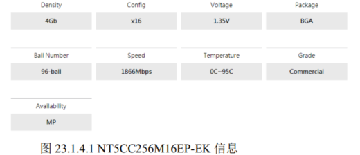
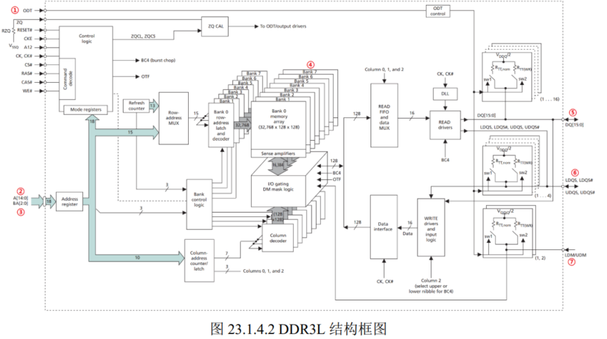
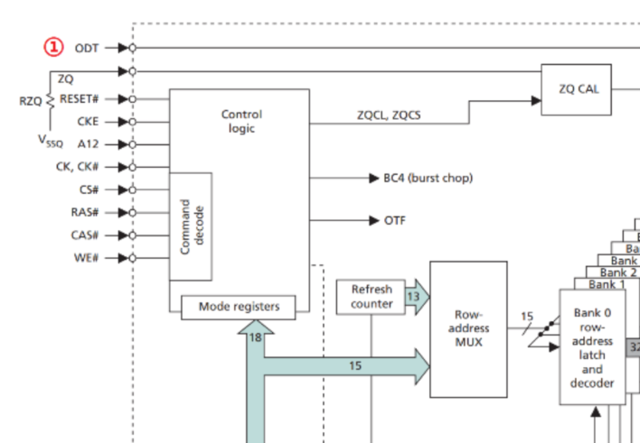
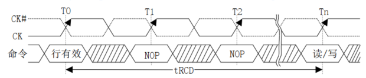
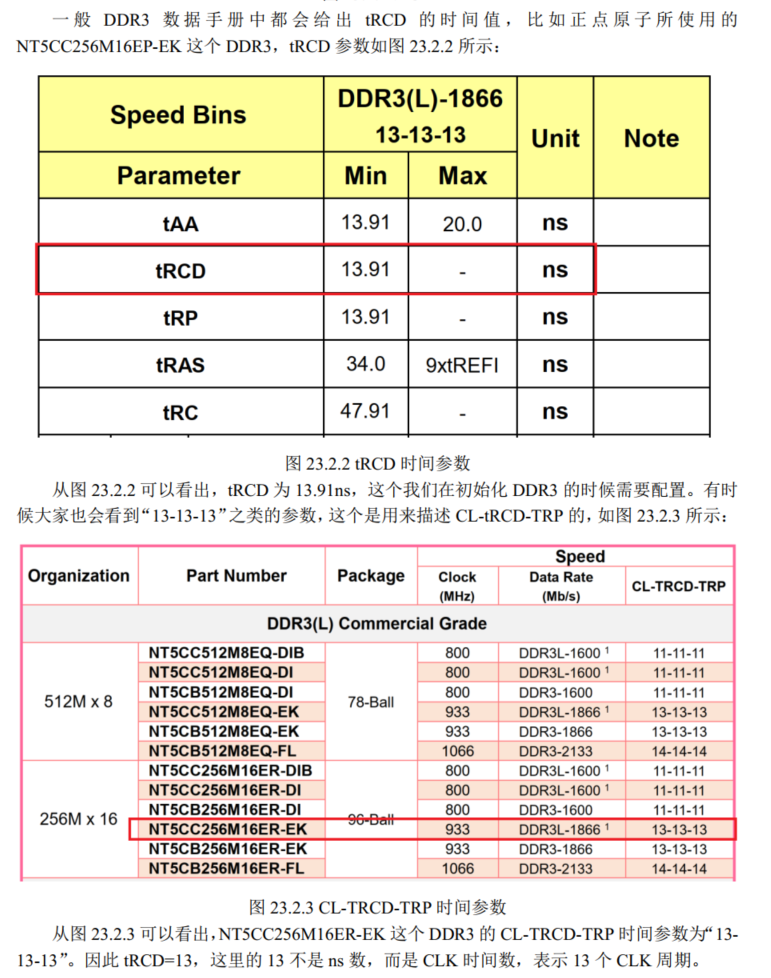
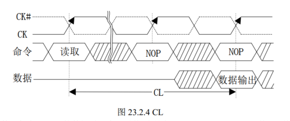
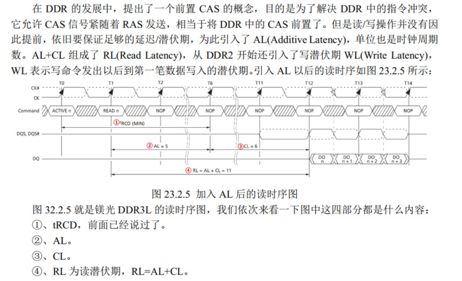
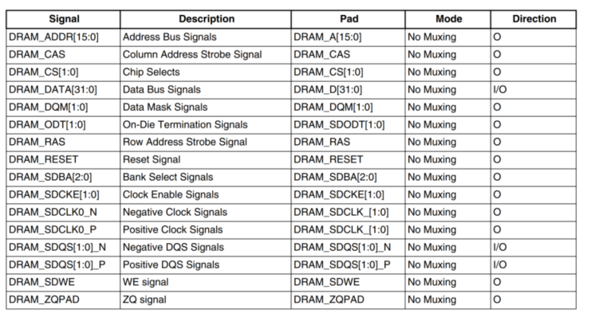
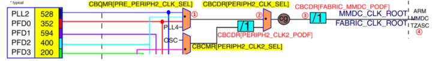
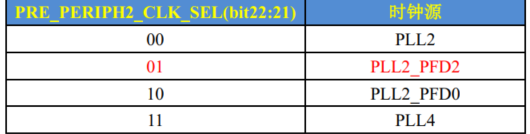

# DDR

## DDR简介

### RAM和ROM

**RAM**

随机存储器，存取速度快直接和CPU通信，掉电后数据丢失，容量小 DDR3就是RAM

**ROM**(flash)

只读存储器(大部分已经可以写了) 存储速度慢，容量大，断电也能存储。NAND flash / EMMC / UFS 就是 ROM

### SRAM

Static Random Access memory 静态随机存储器

静态：只要SRAM上电就会一直保存 直到断电。

成本高，价格高 通常作为SOC内部的RAM或Cache使用

### SDRAM

Synchronous Dynamic Random Access Memory 同步动态随机存储器

集成度高 功耗低 成本低 适合大容量存储 但需要定时刷新保证数据不丢失 适合作为内存条

### DDR

DDR时SDRAM的升级板 Double Data Rate SDRAM 双倍速率的SDRAM

DDR2 在 DDR的基础上增加预取 prefetch 增加了4bit 多读取一倍的数据

DDR3 在 DDR2的基础上prefetch 提高到8bit 又高了一倍 1066~1600 MT/S

DDR3 L 是低压 DDR3 电压为1.35v 一般手机笔记本和嵌入式设备都用这个

NT5CC256M16EP-EK  

NT5CC256M16EP-EK 是一款容量为 4Gb，也就是 512MB 大小、16 位宽、 1.35V、传输速率为 1866MT/S 的 DDR3L 芯片  

① 控制线

ODT：片上终端使能， ODT 使能和禁止片内终端电阻。

ZQ：输出驱动校准的外部参考引脚，此引脚应该外接一个 240 欧的电阻到 VSSQ 上，一般就是直接接地了。

RESET： 复位引脚，低电平有效。

CKE： 时钟使能引脚。

A12： A12 是地址引脚，但是有也有另外一个功能，因此也叫做 BC 引脚， A12 会在 READ和 WRITE 命令期间被采样，以决定 burst chop 是否会被执行。

CK 和 CK#： 时钟信号， DDR3 的时钟线是差分时钟线，所有的控制和地址信号都会在 CK对的上升沿和 CK#的下降沿交叉处被采集。

CS#：片选信号，低电平有效。

RAS#、 CAS#和 WE#：行选通信号、列选通信号和写使能信号

② 地址线

A[14:0]为地址线， A0~A14，一共 15 根地址线，根据 NT5CC256M16ER-EK 的数据手册可知，列地址为 A0~A9，共 10 根，行地址为 A0~A14，共 15 根，因此一个 BANK 的大小就是2^10*2^15*2=32MB*2=64MB，根据图 23.1.4.2 可知一共有 8 个 BANK，因此 DDR3L 的容量就是 64*8=512MB。  

③ bank选择线

一片 DDR3 有 8 个 BANK，因此需要 3 个线才能实现 8 个 BANK 的选择， BA0~BA2 就是用于完成 BANK 选择的。  

④ bank 区域

DDR3 一般都是 8 个 BANK 区域。  

⑤ 数据线

因为是 16 位宽的，因此有 16 根数据线，分别为 DQ0~DQ15。  

⑥ 数据选通引脚

DQS 和 DQS#是数据选通引脚，为差分信号，读的时候是输出，写的时候是输入。 LDQS(有的叫做 DQSL)和 LDQS#(有的叫做 DQSL#)对应低字节，也就是 DQ0~7， UDQS(有的叫做 DQSU)和 UDQS#(有的叫做 DQSU#)，对应高字节，也就是 DQ8~15  

⑦ 数据输入屏蔽引脚

DM 是写数据输入屏蔽引脚。  

## DDR3 关键时间参数

### 传输速率

比如 1066MT/S、 1600MT/S、 1866MT/S 等   最高传输速率

### tRCD参数

RAS-to-CAS Delay 行寻址到列寻址的延迟

在行有效到读写命令发出的间隔

需要配置这个参数

### CL参数

CAS Latency  列地址选通潜伏期 数据从存储单元到内存芯片 IO 接口上还需要一段时间   

可在手册中找到 13个时钟周期

### AL参数

### tRC参数

tRC 是两个 ACTIVE 命令，或者 ACTIVE 命令到 REFRESH 命令之间的周期  手册中查到为47.91ns

### tRAS参数

是 ACTIVE 命令到 PRECHARGE 命令之间的最小时间   手册中查到为34ns

## MMDC控制器

### 简介

MMDC 就是 I.MX6U的内存控制器， MMDC 是一个多模的 DDR 控制器，可以连接 16 位宽的 DDR3/DDR3L、 16 位宽的 LPDDR2， MMDC 是一个可配置、高性能的 DDR 控制器。

MMDC 外设包含一个内核(MMDC_CORE)和 PHY(MMDC_PHY)

MMDC_CORE:内核负责通过 AXI 接口与系统进行通信、 DDR 命令生成、 DDR 命令优化、读/写数据路径  

MMDC_PHY: PHY 负责时序调整和校准，使用特殊的校准机制以保障数据能够在 400MHz被准确捕获。  

**特性**

- 支持 DDR3/DDR3Lx16、支持 LPDDR2x16，不支持 LPDDR1MDDR 和 DDR2。
- 支持单片 256Mbit~8Gbit 容量的 DDR，列地址范围： 8-12 位，行地址范围 11-16bit。 2个片选信号。
- 对于 DDR3，最大支持 8bit 的突发访问。
- 对于 LPDDR2 最大支持 4bit 的突发访问。
- MMDC 最大频率为 400MHz，因此对应的数据速率为 800MT/S。
- 支持各种校准程序，可以自动或手动运行。支持 ZQ 校准外部 DDR 设备， ZQ 校准 DDR I/O 引脚、校准 DDR 驱动能力

### MMDC 控制信号引脚

引脚是DDR 专属的 不存在引脚复用 只需要设置电器属性即可 

注意 DDR 引脚的电气属性寄存器和普通的外设引脚电气属性寄存器不同！  

### MMDC时钟控制源

① CBCMR[PRE_PERIPH2_CLK_SEL] 

选择0x01 PLL2_PFD2

② CBCDR[PERIPH2_CLK_SEL]  设置为 0 选择PLL2_PFD2

③ CBCDR[FABRIC_MMDC_PODF] 分频器 设置为 0 不分频

## DDR3L初始化和测试

ddr_stress_tester DDR初始化工具

- 通过USBOTG接口与开发板相连
- 默认配置文件Excel表， 可设置板子DDR信息生成一个.inc的初始化脚本 包含了初始化信息 如 寄存器地址和对应寄存器的值
- 工具加载.inc进行测试通过USBOTG接口
- 可测试超频性能 一般可超过10-20%
- 可进行12h压力测试

