# LCD和eLCDIF

## LCD

Liquid Crystal Display

### 像素格式

ARGB8888 格式 其中 A-Alpha 透明 

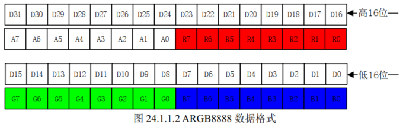

### LCD屏幕接口

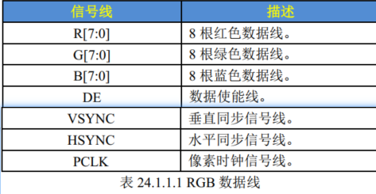

RGBLCD 接口 RGB是数据线 DE VYNC HSYNC PCLK 是控制器线

屏幕原理图

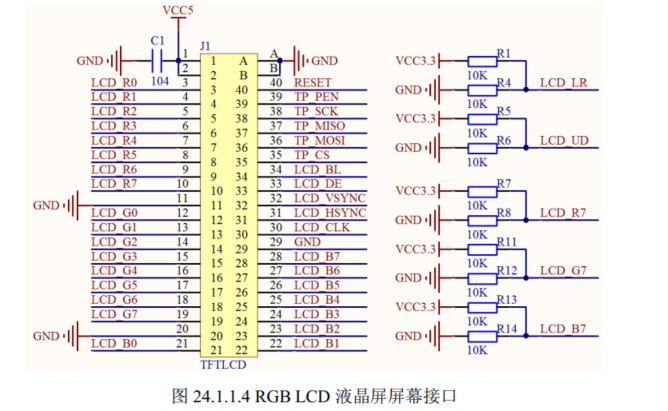

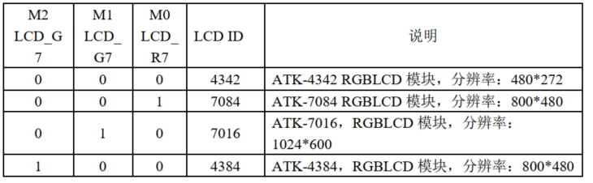

默认情况， R1 和 R6 焊接，设置 LCD_LR 和 LCD_UD，控制 LCD 的扫描方向，是从左到右，从上到下（横屏看）  

LCD_R7/G7/B7 用来设置 LCD 的 ID，由于RGBLCD 没有读写寄存器，也就没有所谓的 ID，这里我们通过在模块上面，控制 R7/G7/B7 的上/下拉，来自定义 LCD 模块的 ID，帮助 MCU 判断当前 LCD 面板的分辨率和相关参数  

### LDC时间参数

一帧想象成绘画 一根笔从左到右从上到下顺序扫描像素点 并且画上颜色

### RGBLCD屏幕时序

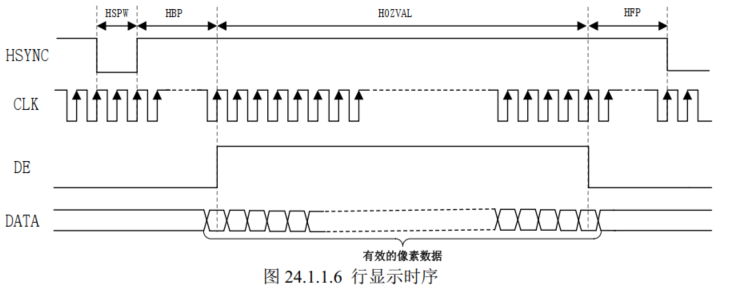

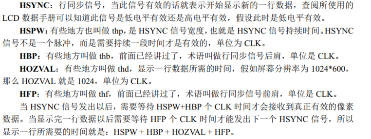


一帧图像就是由很多个行组成的， RGB LCD 的帧显示时序  


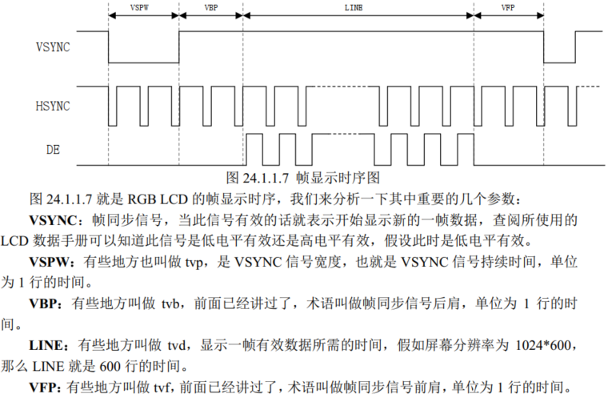


显示一帧所需要的时间就是： VSPW+VBP+LINE+VFP 个行时间，最终的计算公式：

T = (VSPW+VBP+LINE+VFP) * (HSPW + HBP + HOZVAL + HFP)  

因此我们在配置一款 RGB LCD 的时候需要知道这几个参数： HOZVAL(屏幕有效宽度)、LINE(屏幕有效高度)、 HBP、 HSPW、 HFP、 VSPW、 VBP 和 VFP。   

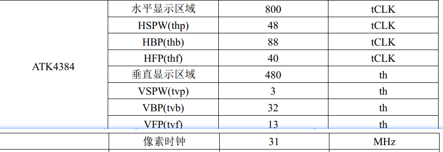

### 像素时钟

像素时钟就是 RGB LCD 的时钟信号  

T = (VSPW+VBP+LINE+VFP) * (HSPW + HBP + HOZVAL + HFP)  =  (3 + 32 + 480 + 13 ) * (48 + 88 + 800 + 40 ) = 515328

60 帧 Tall = T *60 = 30919680 ≈ 31 Mhz 

 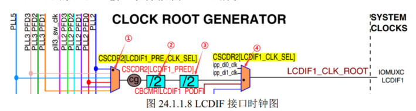

① CSCDR2[LCDIF1_PRE_CLK_SEL] 设置为 2 选择 PLL5 

② CSCDR[LCDIF1_PRED] 分频 1-8

③ CBCMR[LCDIF1_PODF] 再次分频 1- 8

④ CSCDR2[LCDIF1_CLK_SEL] 设置为 0 选择 PLL5分频后的

#### PLL5时钟的计算方式

PLL5_CLK = OSC24M * (loopDivider + (denominator / numerator)) / postDivider  

不使用小数分频的话 PLL5 时钟计算公式就可以简化为 ：

PLL5_CLK = OSC24M * loopDivider / postDivider

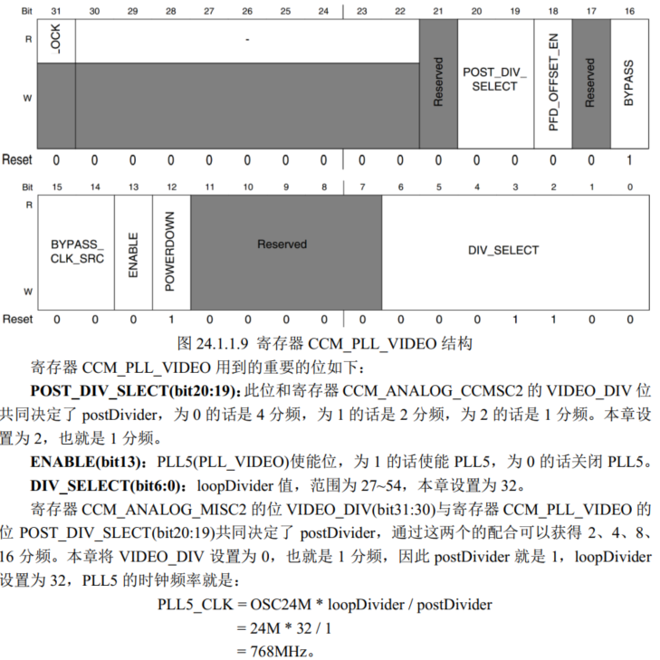

我们要设置为 31 Mhz 24 * 42 / 4 / 8 = 31.5Mhz

## eLCDIF接口

### 简介

- 支持 RGB LCD 的 DE 模式。  
- 支持 VSYNC 模式以实现高速数据传输。
- 支持 ITU-R BT.656 格式的 4:2:2 的 YCbCr 数字视频，并且将其转换为模拟 TV 信号。
- 支持 8/16/18/24/32 位 LCD。

支持接口

**MPU**： MPU 接口用于在 I.MX6U 和 LCD 屏幕直接传输数据和命令  

**VSYNC**  ： VSYNC 接口时序和 MPU 接口时序基本一样，只是多了 VSYNC 信号来作为帧同步  

**DOTCLK** ：DOTCLK 接口就是用来连接 RGB LCD 接口屏幕的， 它包括 VSYNC、 HSYNC、 DOTCLK和 ENABLE(可选的)这四个信号，这样的接口通常被称为 RGB 接口  

**DOTCLK接口时序图**

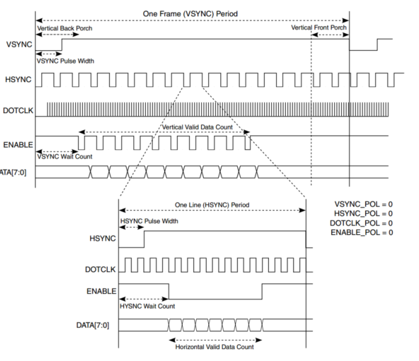

### 寄存器配置

#### LCDIF_CTRL 

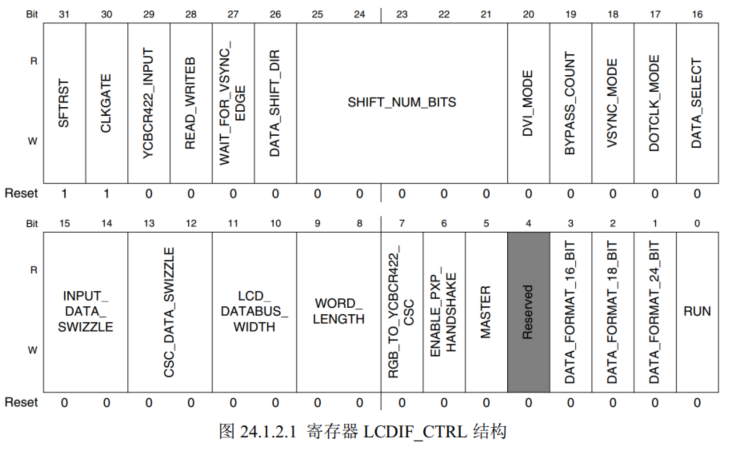

**SFTRST**  当此位为 1 的话就会强制复位 LCD  

**CLKGATE**：正常运行模式下，此位必须为 0

**BYPASS_COUNT**：如果要工作在 DOTCLK 模式的话就此位必须为 1

**VSYNC_MODE** ：此位为 1 的话 LCDIF 工作在 VSYNC 接口模式

**DOTCLK_MODE**：此位为 1 的话 LCDIF 工作在 DOTCLK 接口模式。

**INPUT_DATA_SWIZZLE**：输入数据字节交换设置，此位为 0 的话不交换字节也就是小端模式；为 1 的话交换所有字节，也就是大端模式；为 2 的话半字交换；为 3 的话在每个半字内进行字节交换。设置为 0，也就是不使用字节交换。

**CSC_DATA_SWIZZLE**： CSC 数 据 字 节 交 换 设 置 ， 交 换 方 式 和INPUT_DATA_SWIZZLE 一样，设置为 0，不使用字节交换。

**LCD_DATABUS_WIDTH**： LCD 数据总线宽度，为 0 的话总线宽度为 16 位；为1 的话总线宽度为 8 位；为 2 的话总线宽度为 18 位；为 3 的话总线宽度为 24 位。使用 24 位总线宽度。

**WORD_LENGTH**：输入的数据格式，也就是像素数据宽度，为 0 的话每个像素 16位；为 1 的话每个像素 8 位；为 2 的话每个像素 18 位；为 3 的话每个像素 24 位。

**MASTER**：为 1 的话设置 eLCDIF 工作在主模式。

**DATA_FORMAT_16_BIT**：当此位为 1 并且 WORD_LENGTH 为 0 的时候像素格式为 ARGB555，当此位为 0 并且 WORD_LENGTH 为 0 的时候像素格式为 RGB565。

**DATA_FORMAT_18_BIT**：只有当 WORD_LENGTH 为 2 的时候此位才有效，此位为 0 的话低 18 位有效，像素格式为 RGB666，高 14 位数据无效。当此位为 1 的话高 18 位有效，像素格式依旧是 RGB666，但是低 14 位数据无效。

**DATA_FORMAT_24_BIT**：只有当 WORD_LENGTH 为 3 的时候此位才有效，为 0 的时候表示全部的 24 位数据都有效。为 1 的话实际输入的数据有效位只有 18 位，虽然输入的是24 位数据，但是每个颜色通道的高 2 位数据会被丢弃掉。

**RUN**： eLCDIF 接口运行控制位，1  eLCDIF 使能。

#### LCDIF_CTRL1

**BYTE_PACKING_FORMAT**，此位用来决定在 32 位的数据中哪些字节的数据有效，默认值为 0XF，也就是所有的字节有效，当为 0 的话表示所有的字节都无效。如果显示的数据是24 位(ARGB 格式，但是 A 通道不传输)的话就设置此位为 0X7。  

#### LCDIF_TRANSFER_COUNT

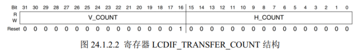

高16位是**V_COUNT**，是 LCD 的垂直分辨率。

低 16 位是 **H_COUNT**，是 LCD 的水平分辨率。  

#### LCDIF_VDCTRL0

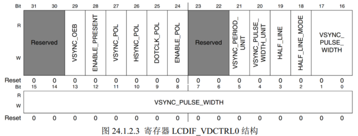


**VSYNC_OEB**： VSYNC 信号方向控制位， 0  VSYNC 是输出，1  VSYNC 是输入。

**ENABLE_PRESENT**： EBABLE 数据线使能位，也就是 DE 数据线。为 1 使能ENABLE 数据线    0 关闭 。

**VSYNC_POL**： VSYNC 数据线极性设置位，为 0 的话 VSYNC 低电平有效，为 1 的话 VSYNC 高电平有效，要根据所使用的 LCD 数据手册来设置。

**HSYNC_POL**： HSYNC 数据线极性设置位，为 0 的话 HSYNC 低电平有效，为 1 的话 HSYNC 高电平有效，要根据所使用的 LCD 数据手册来设置。

**DOTCLK_POL**： DOTCLK 数据线(像素时钟线 CLK) 极性设置位，为 0 的话下降沿锁存数据，上升沿捕获数据，为 1 的话相反，要根据所使用的 LCD 数据手册来设置。

**ENABLE_POL**： EANBLE 数据线极性设置位，为 0 的话低电平有效，为 1 的话高电平有效。

**VSYNC_PERIOD_UNIT**： VSYNC 信号周期单位，为 0 的话 VSYNC 周期单位为像素时钟。为 1 的话 VSYNC 周期单位是水平行，如果使用 DOTCLK 模式话就要设置为 1。

**VSYNC_PULSE_WIDTH_UNIT**： VSYNC 信 号 脉 冲 宽 度 单 位 ， 和VSYNC_PERIOD_UNUT 一样，如果使用 DOTCLK 模式的话要设置为 1。

**VSYNC_PULSE_WIDTH**： VSPW 参数设置位。

#### LCDIF_VDCTRL1  

设置 VSYNC 总周期，就是：屏幕高度+VSPW+VBP+VFP  

#### LCDIF_VDCTRL2

31-18位是 **HSYNC_PULSE_WIDTH**，用来设置 HSYNC 信号宽度，也就是 HSPW。

低 18 位是**HSYNC_PERIOD**，设置 HSYNC 总周期，就是：屏幕宽度+HSPW+HBP+HFP。  

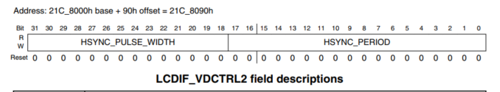

#### LCDIF_VDCTRL3

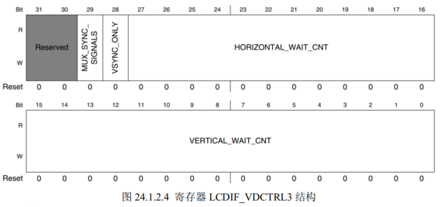

**HORIZONTAL_WAIT_CNT**：此位用于 DOTCLK 模式，用于设置 HSYNC 信号产生到有效数据产生之间的时间，也就是 HSPW+HBP。

**VERTICAL_WAIR_CNT**：和 HORIZONTAL_WAIT_CNT 一样，只是此位用于VSYNC 信号，也就是 VSPW+VBP


#### LCDIF_VDCTRL4  

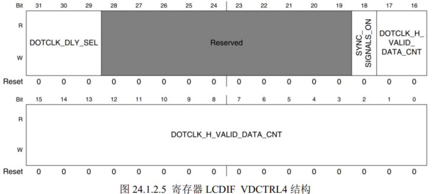

**SYNC_SIGNALS_ON**：同步信号使能位，设置为 1 的话使能 VSYNC、 HSYNC、DOTCLK 这些信号。

**DOTCLK_H_VALID_DATA_CNT**： 设置 LCD 的宽度，也就是水平像素数量。

#### LCDIF_CUR_BUF  和 LCDIF_NEXT_BUF  

分别为当前帧和下一帧缓冲区，也就是 LCD 显存。一般这两个寄存器保存同一个地址，也就是划分给 LCD的显存首地址。  

#### 配置代码

```c
    // CTRL
    // 31       0   写1复位
    // 19       1   旁路计数 
    // 17       1   工作在dotclk模式
    // 1514     00  输入数据不交换
    // 1312     00  csc不交换
    // 1110     11  24位
    // 9 8      11  24位 RGB88
    // 5        1   eLCDIF 工作在主模式
    // 1        0   24位都有效

    LCDIF->CTRL |= (0 << 31) | (1 << 19) | (1 << 17) | (0x00 << 14) | (0x00 << 12) | (0x03 << 10) | (0x03 << 8) | (1 << 5) | (0 << 1);

    //LCDIF->CTRL1 
    // 19:16   0x7  ARGB 24位 
    LCDIF->CTRL1 = 0x7 << 16
    // LCDIF_TRANSFER_COUNT
    LCDIF->TRANSFER_COUNT = (tftlcd_dev.height << 16) | (tftlcd_dev.width << 0);

    //LCDIF_VDCTRL0
    // 29       0   VSYNC 是输出
    // 28       1   enable 数据线
    // 27       0   VSYNC 是低电平有效
    // 26       0   HSYNC 是低电平有效
    // 25       0   DOTCLK 上升沿有效
    // 24       1   Enbale 信号 高电平有效
    // 2120    11   DOTCLK 模式下都设置位1
    // 17：0    vspw参数
    LCDIF->VDCTRL0 = 0;
    LCDIF->VDCTRL0 |= (0 << 29) | (1 << 28) | (0 << 27) | (0 << 26) | (0 << 25) | (1 << 24) | (0x03 << 20) | (tftlcd_dev.vspw << 0);

    // LCDIF_VDCTRL1
    LCDIF->VDCTRL1 = tftlcd_dev.height + tftlcd_dev.vspw + tftlcd_dev.vfpd + tftlcd_dev.vbpd;

    // LCDIF_VDCTRL2
    LCDIF->VDCTRL2 = (tftlcd_dev.hspw << 18) | (tftlcd_dev.width + tftlcd_dev.hspw + tftlcd_dev.hbpd + tftlcd_dev.hfpd);

    // LCDIF_VDCTRL3
    LCDIF->VDCTRL3 = (tftlcd_dev.hspw + tftlcd_dev.hbpd) << 16 | (tftlcd_dev.vspw + tftlcd_dev.vbpd);


    // LCDIF_VDCTRL4
    // 18      1   同步信号使能
    // 17：0   width
    LCDIF->VDCTRL4 = (1 << 18) | (tftlcd_dev.width);

    //设置当前显存地址和下一帧地址
    LCDIF->CUR_BUF = tftlcd_dev.framebuffer;
    LCDIF->NEXT_BUF = tftlcd_dev.framebuffer;
```

