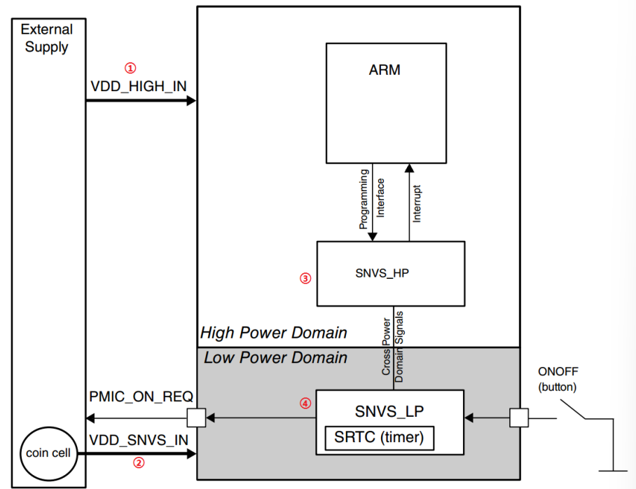

# SNVS(Secure Non-Volatile Storage)

In imx6ull RTC is in SNVS which include RTC, a monotonic counter and some common registers.

SNVS is two child model. 

SNVS_HP(high power)  chip power

SNVS_LP(low) -- always-powered-on

SRTC is our RTC today.

